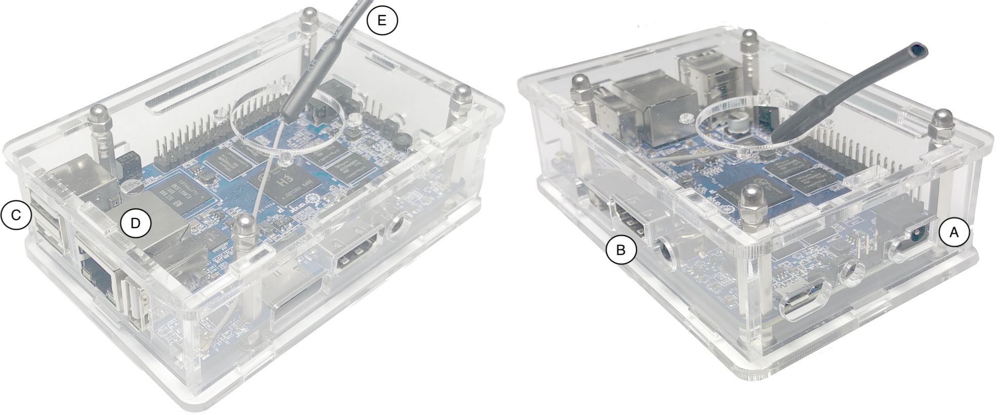
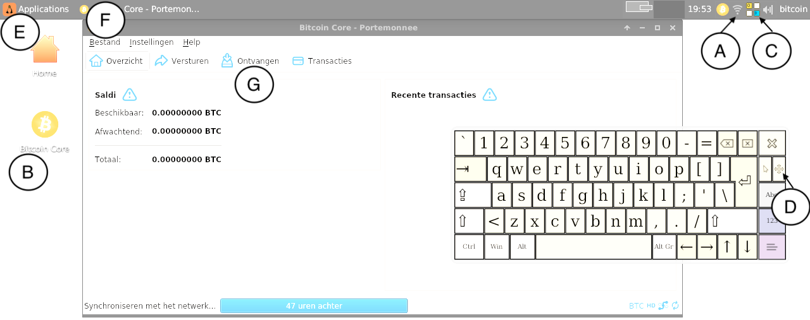

% Bitcoin Computer Handleiding

Verpakking
===========

Gefeliciteerd met je aankoop! Met deze handleiding kan je zo snel mogelijk aan de slag. Mocht je ergens niet uitkomen of indien er iets stuk is, stuur dan een mailtje naar `sjors@bitcoin-computer.nl` (denk aan het streepje).

Als het goed bevat de verpakking het volgende:

* pakbon met retourinformatie
* de Bitcoin Computer
* USB muis
* adapter met kabel
* netwerk kabel
* HDMI kabel voor TV / monitor

Installatie
===========

{ }

Sluit de voeding aan op het apparaat (Figuur 1 - A). Sluit de HDMI kabel aan op een TV of monitor (B). Sluit de muis aan op één van de USB poorten (C). Sluit indien mogelijk de netwerkkabel aan op een modem of router (D). Je ook gewoon wifi gebruiken (E), maar een kabel is betrouwbaarder.

Steek als laatste de adapter in het stopcontact. De computer start vanzelf op. Je kan de computer bedienen met de muis en een on-screen toetsenbord. Indien je zelf een USB toetsenbord hebt, kan je dat ook aansluiten.

Het wachtwoord is `bitcoin`. Bij de eerste keer inloggen wordt je gevraagd om dit wachtwoord aan te passen. Let op dat je hierbij eerst het oude wachtwoord nogmaals moet invoeren.

{ }

Om de wifi in te stellen, klik op het icoontje naast de klok (fig. 2: A). Start vervolgens Bitcoin Core via het bureaublad icoon (B). Het onscreen toetsenbord kan je aanpassen met (C) en verslepen via toets (D).

Veiligheid
==========

Allereerst je eigen veiligheid. Ook al is de kans op oververhitting zeer klein, zet de computer en adapter niet vlak naast brandbare objecten. Let op dat kinderen en huisdieren niet de schroefjes losdraaien en opeten; spinazie is een betere manier om ijzertekort te voorkomen.

Dit apparaat is (vooralsnog) niet geschikt voor het bewaren van grote hoeveelheden bitcoin. Gebruik hiervoor een hardware wallet, bijvoorbeeld een Ledger of Trezor. De hardeschijf is niet encrypted dus iemand met fysieke toegang tot het apparaat kan, ook zonder login wachtwoord, waarschijnlijk bij je wallet. Zo iemand kan ook malware installeren die bijvoorbeeld je toetsaanslagen afluistert, waardoor ook een wallet wachtwoord (zie verderop) slechts beperkte veiligheid biedt. Daar staat tegenover dat dit apparaat dankzij Linux vrij goed beveiligd is tegen hackers op het internet. En omdat je het alleen voor Bitcoin gebruikt, heb je ook veel minder kans om per ongeluk zelf malware te installeren.

Kies een sterk wachtwoord. Tip: installeer 1Password op je smartphone en laat dat een nieuw wachtwoord voor je aanmaken.

Bitcoin Core gebruikt volledig automatisch Tor op de achtergrond. Dit is voornamelijk om je privacy iets minder dramatisch slecht te maken; anders kan je internet provider en het sleepnet mogelijk kunnen zien welke bitcoins van jou zijn. Daarnaast zorgt dit dat je node beter verbonden is met de rest van het netwerk en draag je bij aan de privacy van mensen in minder democratische landen. Je browser gebruikt geen Tor (werkt helaas nog niet op dit type computer).

Backups
=======

Je bitcoins vallen niet onder de garantie. Koop een klein USB stickje, kies Bestand (Fig 2: F) en dan Backup Portemonnee. Blader vervolgens naar de USB stick.

Tip 1: het is mogelijk om een wachtwoord in te stellen voor USB sticks.

Tip 2: vertrouw nooit een USB stick die je op een conferentie krijgt, ergens op kantoor vindt of ooit mee hebt genomen op een verre reis.

Tip 3: data op een USB stick vergaat na verloop van tijd. Plug de USB stick minimaal één keer jaar in een computer en maak liefst gelijk ook een nieuwe backup op een andere USB stick.

Tips voor gebruik
===========

Zet de computer alleen uit via het Applications menu (fig. 2: E). Wacht in ieder geval tot de Bitcoin Core applicatie volledig afgesloten is. Bij plotseling uitschakelen of een stroomstoring is er een (kleine) kans dat je de gehele blockchain opnieuw moet downloaden, wat ongeveer een week duurt.

Laat de computer bij voorkeur aan staan als je hem niet gebruikt, met de Bitcoin Core applicatie geopend, zodat deze met de blockchain gesynchroniseerd blijft. Anders kan het enkele uren duren voordat alles weer up to date is. De monitor en muis kan je gewoon loskoppelen.

Zet de wifi uit als je het niet nodig hebt (A).

Hoe kom je aan Bitcoin?
-------

Er zijn verschillende plekken waar je Bitcoin kan kopen. https://bitonic.nl is een Nederlandse aanbieder waarbij je met iDeal kan betalen, ook voor een kleine hoeveelheid als €10 (pakweg 0.001 BTC in juli 2018). Ga naar het "Ontvangen" tabblad (fig. 2: G) en klik op Betalingsverzoek knop. Dit adres moet je invullen tijdens het aankoopproces. Noteer het of - handiger - klik "Kopieer adres" en gebruik de browser op de computer zelf (via Applications).

Je kan dit gewoon tijdens het synchroniseren doen, maar de bitcoins komen pas in de applicatie tevoorschijn wanneer de synchronisatie klaar is.

Waar kan ik Bitcoin uitgeven?
-------

Als je een pre-paid sim kaart hebt, kan je die wellicht opwaarderen via https://bitrefill.com/, waar je tevens tegoed voor sommige online games kan kopen.

Om te betalen kan je het adres en bedrag overtypen of copy-pasten, maar beter is om - indien beschikbaar - de betalings URL (`bitcoin:ADRES?amount=HOEVEELHEID`) te kopiëren en via Bestand -> Open URL in te voeren.

Dichter bij huis is https://thuisbezorgd.nl, maar op het moment van schrijven werkt dat alleen als je eerst Tor uitzet in Bitcoin Core. Niet ideaal voor je privacy, maar het kan: Instellingen -> Opties -> Open Configuratiebestand, zet `# ` voor de regel met `proxy`, sla op en start Bitcoin Core opnieuw. Nadat je de betaal URL gekopieerd hebt, zie je in het Versturen tabblad een groen vak met daarin het adres en bedrag reeds ingevuld.

Bitcoin wallet wachtwoord
-------
Het is mogelijk om een wachtwoord in te stellen voor het uitgeven van bitcoin. Dit is vooral handig als je de computer aan laat staan. Kies daarvoor in het menu Instellingen de optie "Versleutel Portemonnee". Maak hierna een nieuwe backup.

Het is onmogelijk om een vergeten wachtwoord te herstellen!

Leer meer over Bitcoin
------

Jameson Lopp heeft over de jaren heen informatie verzamelend voor zowel beginners als gevorderden: https://lopp.net/bitcoin.html

Het internet is een mijnenveld van desinformatie over Bitcoin, dus blijf scherp: don't trust, verify!

Waarom een Bitcoin Core full node, en niet wallet X?
-------

Elke wallet heeft z'n voor- en nadelen. Een full node geeft je maximale autonomie en betere privacy dan de meeste alternatieven.

Door de blockchain volledig te downloaden en te controleren kan niemand je voor de gek houden. Dit is echter moeilijk gebruiksvriendelijk krijgen. De meeste wallets "spelen vals" door de blockchain niet te downloaden. In plaats daarvan vraagt de wallet aan een server hoeveel bitcoin je hebt. Maar wat als die webserver liegt? En de eigenaar van de server kan dus zien hoeveel bitcoin van jou zijn. In combinatie met je IP adres, misschien zelfs je email adres, cookies en fingerprinting zegt dat dus erg veel over je.

Er zijn daarnaast ook een soort bitcoin banken, die namens jou je bitcoin bewaren. Het voordeel is dat dat als je je wachtwoord vergeten bent, je via hun helpdesk uiteindelijk weer bij je bitcoin kan. Het nadeel is dat ze je bitcoin in beslag kunnen nemen of failliet kunnen gaan; google eens "MtGox".

Hardware wallets bieden, naast gebruiksvriendelijkheid, een betere bescherming tegen hackers dan een full node. Dat gaat wel weer ten koste van privacy. Zie gevorderden voor hoe je een full node kan combineren met een hardware wallet; hopelijk wordt dat in de toekomst makkelijker.

Ook een full node is niet perfect; er is nog een hoop werk nodig om privacy in Bitcoin te verbeteren.

Voor gevorderden
=============

Gebruik zonder monitor
-------

Je kan ook vanaf een andere computer (zelfs een smartphone) inloggen, dan heb je maar één keer een scherm nodig. Open een terminal en zoek je IP adres op met `ifconfig`. Log vervolgens vanaf een andere computer in met SSH. Tip: Google `authorized_keys` en `ssh config`.

Zelf opnieuw installeren
-------

Door het apparaat zelf volledig opnieuw te installeren, hoef je mij en de postbode minder te vertrouwen. Ik heb hier een online handleiding voor geschreven: https://medium.com/provoost-on-crypto/bitcoin-on-an-orange-pi-using-armbian-66c3523bbfc0 (Google "provoost orange bitcoin")

Gebruik i.c.m. hardware wallet
-------

Probeer Electrum Personal Server eens: https://github.com/chris-belcher/electrum-personal-server

Volledige blockchain op USB stick / HDD
------

Je kan eventueel een 256 GB USB stick of een externe hardeschijf koppelen aan de computer. Om dat te gebruiken kan je het beste wachten tot versie 0.17 uit is (download de 32 bit ARM versie). Voeg `blocksdir=/mount_point` toe aan `bitcoin.conf`, verwijder `~/.bitcoin/blocks` en `~/.bitcoin/chainstate` en start Bitcoin Core op. De blockchain wordt nu helemaal opnieuw gedownload. Dit duurt ongeveer vijf dagen. De ruwe block data staat nu op de externe schijf, alle andere gegevens zoals je wallet en een aantal indexes blijven op het (snellere) eMMC geheugen staan. Zorg dat je niet per ongeluk de USB plug loskoppelt als Bitcoin Core geopend is.

Harddisk encryptie
------

Voor extra privacy als iemand je apparaat probeert uit te lezen. Ik heb nog niet uitgezocht hoe dit moet, dus Google zelf even "Ubuntu Bionic harddisk encryption".
